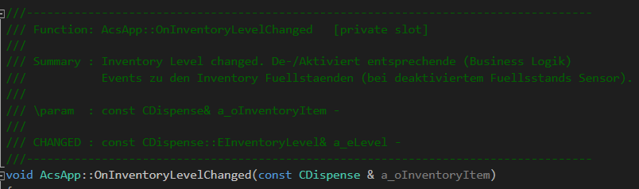

# AutoDoc

Während der Bachelorarbeit erarbeitet, um den Aufwand zum Erstellen von Doxygen-Kommentaren zu reduzieren.  
Das Plugin zur Entwicklungsumgebung "Visual Studio" parst automatisch Methodensignaturen aus Header- und  
Source-Datei und generiert daraus den automatisch generierbaren Teil der Kommentare.  
Dabei werden alte Kommentare beibehalten und vor dem Entfernen als "CHANGED" markiert.